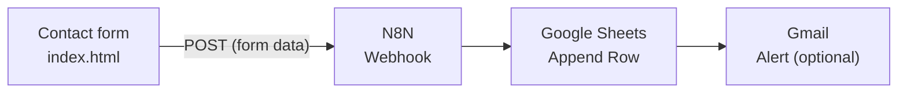

<div align="center">

# N8N Contact Form to Google Sheets — HTML Form + N8N Webhook (No Backend)

**Free N8N contact form template: send HTML form submissions to Google Sheets through an N8N Webhook and get a Gmail email alert for every new lead.**
No backend, no database, no PHP, no Google Apps Script. It's one `index.html` file you can host anywhere.

[](https://n8n.io)
[](https://sheets.new)
[](#step-4--email-alert-optional)
[](index.html)

[](https://youtu.be/YqorbcCGAqE)

</div>

---

## Contents

- [How it works](#how-it-works)
- [Features](#features)
- [Quick start (5 minutes)](#quick-start-5-minutes)
- [Full setup](#full-setup)
- [Test mode vs live mode](#test-mode-vs-live-mode)
- [Form fields](#form-fields)
- [Adding your own field](#adding-your-own-field)
- [Use cases](#use-cases)
- [Troubleshooting](#troubleshooting)
- [FAQ](#faq)
- [Let's Work Together](#lets-work-together)

---

## How it works



1. A visitor fills in the form on your website and clicks **Send Message**.
2. The form posts the data straight to your **N8N Webhook**.
3. N8N adds it as a **new row in Google Sheets**.
4. Optionally, N8N **emails you** the lead details.

---

## Features

| | |
|---|---|
| **9 fields** | Name, Email, Phone, Company, City, Budget, Subject, Preferred Date, Message |
| **No CORS setup** | Sends the data as `form-urlencoded`, so the browser skips the CORS preflight and it works with any N8N Webhook |
| **Test mode** | Add `?test` to the page URL to send to the N8N **Test URL** instead of the Production URL |
| **Demo fill** | The info icon fills the form with sample data (a new set on every click) for quick testing |
| **Clear feedback** | Sending overlay, a spinner on the button, and success or error popups |
| **Setup guard** | Until you paste your webhook URLs, the form shows a "Webhook URL missing" message instead of failing silently |
| **Mobile ready** | Responsive layout, 16px inputs so iOS doesn't zoom in, and it respects reduced-motion settings |

---

## Quick start (5 minutes)

1. **Download** `index.html` from this repo.
2. **Build the N8N workflow** (Webhook → Google Sheets). See [Full setup](#full-setup).
3. **Paste your webhook URLs** into `index.html`:

   ```js
   const N8N_TEST_URL = 'PASTE_YOUR_N8N_TEST_URL_HERE';
   const N8N_LIVE_URL = 'PASTE_YOUR_N8N_PRODUCTION_URL_HERE';
   ```

4. **Upload** `index.html` to any static host, such as [Netlify Drop](https://app.netlify.com/drop), GitHub Pages or Hostinger.
5. **Publish** the workflow in N8N. Every form submission now becomes a new row in your sheet

---

## Full setup

### Step 1 · Google Sheet

Open [sheets.new](https://sheets.new), name it **Contact Form Leads**, click cell **A1** and paste this line. The 10 headers fill **A1:J1**:

```
Timestamp	Name	Email	Phone	Company	City	Budget	Subject	Preferred Date	Message
```

### Step 2 · Webhook node

In N8N, click **+ Create Workflow**, then add a **Webhook** node:

| Setting | Value |
|---|---|
| HTTP Method | `POST` |
| Path | `contact-form` |
| Authentication | None |
| Respond | Immediately |

Copy the **Test URL** and the **Production URL** from this node and paste them into `index.html`. They look like this:

```
https://your-name.app.n8n.cloud/webhook-test/contact-form   ← Test URL
https://your-name.app.n8n.cloud/webhook/contact-form        ← Production URL
```

### Step 3 · Google Sheets node

Click **+** after the Webhook node → **Google Sheets** → **Append row in sheet**:

| Setting | Value |
|---|---|
| Credential | Sign in with Google |
| Resource / Operation | Sheet Within Document / Append Row |
| Document / Sheet | Contact Form Leads / Sheet1 |
| Mapping Column Mode | Map Each Column Manually |

Then map the columns:

| Column | Expression |
|---|---|
| Timestamp | `{{ $now.toUTC().toISO() }}` |
| Name | `{{ $json.body.name }}` |
| Email | `{{ $json.body.email }}` |
| Phone | `{{ $json.body.phone }}` |
| Company | `{{ $json.body.company }}` |
| City | `{{ $json.body.city }}` |
| Budget | `{{ $json.body.budget }}` |
| Subject | `{{ $json.body.subject }}` |
| Preferred Date | `{{ $json.body.preferred_date }}` |
| Message | `{{ $json.body.message }}` |

> [!IMPORTANT]
> Click **Add option → Cell Format → Use Format From N8N**. This keeps the leading `0` on phone numbers and stops Google Sheets from changing the date.

### Step 4 · Email alert (optional)

Click **+** after the Google Sheets node → **Gmail** → **Send a message**. Set **To** to your own email address and **Email Type** to Text.

**Subject**
```
New lead: {{ $('Webhook').item.json.body.name }} - {{ $('Webhook').item.json.body.subject }}
```

**Message**
```
New contact form submission
Name: {{ $('Webhook').item.json.body.name }}
Email: {{ $('Webhook').item.json.body.email }}
Phone: {{ $('Webhook').item.json.body.phone }}
Company: {{ $('Webhook').item.json.body.company }}
City: {{ $('Webhook').item.json.body.city }}
Budget: {{ $('Webhook').item.json.body.budget }}
Subject: {{ $('Webhook').item.json.body.subject }}
Preferred Date: {{ $('Webhook').item.json.body.preferred_date }}
Message:
{{ $('Webhook').item.json.body.message }}
```

> [!TIP]
> Use `$('Webhook')` here, not `$json`. The Gmail node comes after Google Sheets, so `$json` holds the Sheets result, not the form data.
> Also add **Add option → Reply To** with `{{ $('Webhook').item.json.body.email }}`. Then clicking **Reply** in Gmail answers the customer directly.

### Step 5 · Go live

Click **Publish** (top right). In older N8N versions, switch the workflow to **Active**. Every run is logged in the **Executions** tab.

---

## Test mode vs live mode

| Page URL | Sends to | When it works |
|---|---|---|
| `your-site.com/?test` | Test URL (`/webhook-test/…`) | Only while **Listen for test event** is active in the N8N editor |
| `your-site.com` | Production URL (`/webhook/…`) | Once the workflow is **Published** |

You only deploy the page once. Switch between test and live by adding or removing `?test`.

---

## Form fields

Each field reaches N8N as `$json.body.<name>`:

| Field | `name` | Type | Required |
|---|---|---|:---:|
| Full Name | `name` | text | Yes |
| Email | `email` | email | Yes |
| Phone | `phone` | tel | Yes |
| Company | `company` | text | |
| City | `city` | text | |
| Budget | `budget` | number | |
| Subject | `subject` | text | Yes |
| Preferred Contact Date | `preferred_date` | date (`YYYY-MM-DD`) | |
| Message | `message` | textarea | |

---

## Adding your own field

1. Copy any `.form-group` block in `index.html` and give the input a new `name` (for example `website`).
2. Add a matching column header in your sheet (for example `Website`).
3. In the Google Sheets node, map it: `{{ $json.body.website }}`.

That's all. The form sends every named input automatically.

---

## Use cases

- **Lead capture** for agencies, freelancers and small businesses: every enquiry lands in a Google Sheet
- **Website contact form** on a static site (Netlify, GitHub Pages, Hostinger) without a server
- **Quote or booking requests**, with the Budget and Preferred Date fields already built in
- **Learning N8N**: a simple first workflow (Webhook → Google Sheets → Gmail) for beginners

---

## Troubleshooting

| Problem | Fix |
|---|---|
| "Webhook URL missing" popup | Paste your N8N URLs into `N8N_TEST_URL` / `N8N_LIVE_URL` in `index.html`. |
| "Webhook is not registered" / 404 | With `?test`: click **Listen for test event** first. Without it: the workflow must be **Published**. |
| Row added, but the cells are empty | Use `$json.body.name`, not `$json.name`. |
| Phone lost its leading 0 | Set **Cell Format** to **Use Format From N8N**. |
| Data in the wrong columns | The headers in row 1 must exactly match [Step 1](#step-1--google-sheet). |
| Email shows `undefined` | The first node must be named **Webhook**. If you renamed it, change `$('Webhook')` to the new name. |
| No alert email | Check your Spam folder, make sure **To** is filled in, and check that the Gmail credential shows **Account connected**. |

---

## FAQ

### How do I send HTML form data to Google Sheets with N8N?
Post the form to an N8N **Webhook** node, then add a **Google Sheets → Append Row** node that maps `$json.body.<field>` to each column. This repo gives you the ready-made form, and [Full setup](#full-setup) shows each node's settings.

### Do I need a backend, PHP or Google Apps Script?
No. The browser posts straight to N8N, and N8N writes to Google Sheets. You only host one static HTML file.

### Why doesn't the form hit a CORS error?
It sends `application/x-www-form-urlencoded` data with a plain `POST`. That's a "simple request", so the browser skips the CORS preflight that usually blocks JSON posts to webhooks.

### Does it work with self-hosted N8N?
Yes. Use your own instance's Webhook URLs (for example `https://n8n.your-domain.com/webhook/contact-form`). It works with both N8N Cloud and self-hosted N8N.

### Can I get an email or WhatsApp alert for every new submission?
Yes. [Step 4](#step-4--email-alert-optional) adds a Gmail alert. You can add a WhatsApp or Slack node the same way, after the Google Sheets node.

### Is it free?
Yes. The form is free to use, and Google Sheets and Gmail are free. N8N is free to self-host, or you can use N8N Cloud.

---

## Let's Work Together

Need a custom automation, dashboard or web app?

- **WhatsApp:** https://whatsapp.rameezscripts.com
- **Email:** [Contact@rameezscripts.com](mailto:Contact@rameezscripts.com)

<div align="center">

**Developed by Mohammad Rameez Imdad (Rameez Scripts)**
[YouTube @rameezimdad](https://www.youtube.com/@rameezimdad) · Subscribe for more!

_Built by Rameez Scripts._

</div>
